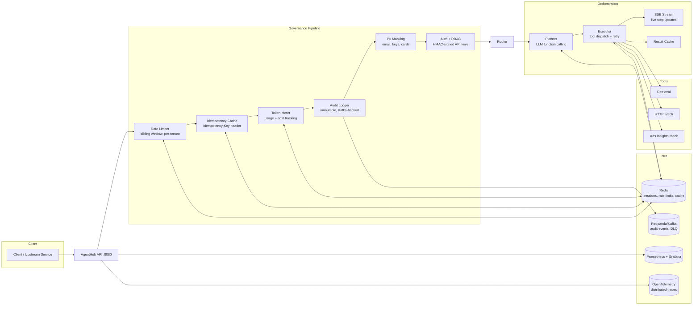

# LLM Serving Infrastructure — AgentHub


The platform layer that makes LLM applications production-ready: per-tenant rate limiting, idempotent execution, token metering, immutable audit logs, PII masking, RBAC, circuit breaking, and end-to-end OpenTelemetry tracing — all before the LLM call is made.

> The gap between a working LLM demo and a production LLM system is this governance layer. Most teams build it ad-hoc, under pressure, after an incident. This project builds it first.

**Target roles:** AI platform engineer, LLM infrastructure, backend for AI systems. For ML modeling roles, see [RecommendIt](../recommendit) or [FeatureFlow](../featureflow) instead.

---

## Architecture



---

## What the Governance Pipeline Does

Every request passes through six stages before reaching the planner:

| Stage | What It Enforces |
|---|---|
| **Rate Limiter** | Sliding-window per-tenant QPS with burst. Returns `429` + `Retry-After`. |
| **Idempotency Cache** | `Idempotency-Key` header — duplicate keys return the cached response, safe for retries. |
| **Token Meter** | Tracks token consumption and USD cost per request and session. Exposed as Prometheus metrics. |
| **Audit Logger** | Every request written to Kafka `audit.logs` topic: key, role, route, status, tokens, cost, IP, trace ID. Append-only. |
| **PII Masking** | Email addresses, API/AWS keys, and credit cards are masked before logs or audit events leave the system. |
| **RBAC** | HMAC-signed API keys with role enforcement. Admin, developer, and client roles with scoped permissions. |

None of this is optional in a real multi-tenant LLM system. The governance pipeline is the engineering substance that separates AgentHub from a FastAPI wrapper around OpenAI.

---

## Key Design Decisions

**Why idempotency as a first-class primitive?**
LLM calls are expensive and non-deterministic. Network failures after the LLM responds but before the client receives the result cause clients to retry — potentially triggering a second LLM call and billing event. Idempotency keys ensure that retried requests return the cached response from the first successful execution. The 24h TTL in Redis covers any reasonable retry window without unbounded memory growth.

**Why Kafka for audit logs instead of a database?**
Audit logs must be immutable and append-only — properties a relational database can technically provide but that Kafka guarantees by design. Kafka topics are also the natural integration point for downstream consumers (S3 retention rollup, compliance reporting, anomaly detection). The DLQ consumer handles unrecoverable tool failures without blocking the main processing path.

**Why sliding-window rate limiting over fixed-window?**
Fixed-window rate limiting allows burst behavior at window boundaries: a client can send N requests at the end of window 1 and N requests at the start of window 2, effectively doubling their permitted rate for a brief period. Sliding-window rate limiting enforces a smooth N-per-second constraint regardless of timing. This matters for protecting downstream LLM API rate limits.

**Why OpenTelemetry over custom metrics?**
OpenTelemetry traces propagate context across service boundaries automatically. Every span includes tenant ID, API key ID, session ID, tool name, attempt count, and cache status — without any manual plumbing. This is critical for debugging multi-step agent executions where the failure may be in step 4 of 7, inside a tool retry, with a specific tenant configuration.

---

## Engineering Depth

| Capability | Implementation |
|---|---|
| Rate limiting | Sliding-window per-API-key, configurable QPS + burst, `Retry-After` header |
| Idempotency | Redis-backed, 24h TTL, returns cached response on duplicate key |
| Token metering | Per-request and per-session usage + USD cost, Prometheus export |
| Audit logging | Kafka `audit.logs`, PII-masked, append-only, S3 rollup consumer |
| RBAC | HMAC-signed API keys, admin/developer/client roles, key rotation + revocation |
| Circuit breaking | Per-tool circuit breaker with configurable failure threshold and recovery |
| Dead-letter queue | Unrecoverable tool failures routed to Kafka DLQ with full context |
| SSE streaming | Real-time step updates with 15s heartbeats, graceful stream termination |
| Session management | Redis-backed with TTL, rehydration for workflow continuity |
| Distributed tracing | OpenTelemetry spans: request → plan → step → LLM call, OTLP export |
| Load testing | k6 scripts with SLO assertions: p95 < 300ms (non-LLM), p95 < 2.5s (single-tool) |
| Test coverage | 87% coverage across auth, executor, idempotency, masking, streaming, rate limiting |

---

## SLOs

Validated with k6 load tests (`perf/load_test.js`):

| Endpoint type | p95 latency target | Success rate |
|---|---|---|
| Non-LLM endpoints | < 300ms | 99.9% |
| Single-tool plan + execute | < 2.5s | 99.9% |

---

## Quickstart

```bash
git clone https://github.com/sarihammad/agenthub.git
cd agenthub
cp .env.example .env       # add OPENAI_API_KEY
docker-compose up --build  # API :8080, Grafana :3000, Prometheus :9090
```

Bootstrap an admin API key:
```bash
docker exec -it agenthub-api-1 python -c "
import asyncio
from agenthub.deps import get_redis
from agenthub.auth.api_keys import create_api_key
async def main():
    redis = await get_redis()
    key = await create_api_key(redis, 'admin', 'bootstrap_admin')
    print(f'Admin API Key: {key[\"api_key\"]}')
    await redis.close()
asyncio.run(main())
"
```

Then create a client key, session, plan, and execute:
```bash
export ADMIN_KEY="<admin_key>"

# Create client key
CLIENT_KEY=$(curl -s -X POST http://localhost:8080/v1/admin/api-keys \
  -H "Authorization: Bearer $ADMIN_KEY" \
  -H "Content-Type: application/json" \
  -d '{"role": "client", "name": "demo"}' | jq -r '.api_key')

# Create session
SESSION_ID=$(curl -s -X POST http://localhost:8080/v1/sessions \
  -H "Authorization: Bearer $CLIENT_KEY" \
  -H "Content-Type: application/json" -d '{}' | jq -r '.session_id')

# Plan + execute
curl -X POST http://localhost:8080/v1/plan \
  -H "Authorization: Bearer $CLIENT_KEY" \
  -H "Content-Type: application/json" \
  -d "{\"session_id\": \"$SESSION_ID\", \"goal\": \"Get ROAS for advertiser 123 over 7 days\", \"tools_allowed\": [\"ads_metrics_mock\"]}"
```

Stream live events:
```bash
curl -N "http://localhost:8080/v1/stream?session_id=$SESSION_ID" \
  -H "Authorization: Bearer $CLIENT_KEY"
```

---

## API Reference

| Method | Path | Auth | Description |
|---|---|---|---|
| POST | `/v1/sessions` | Any | Create session |
| GET | `/v1/sessions/{id}` | Any | Get session (masked) |
| POST | `/v1/plan` | Any | LLM-powered plan generation |
| POST | `/v1/execute` | Any | Execute a plan |
| GET | `/v1/stream` | Any | SSE stream of live step events |
| GET | `/v1/tools` | Any | List available tools |
| POST | `/v1/admin/api-keys` | Admin | Create/rotate API keys |
| GET | `/healthz` | None | Health check |
| GET | `/metrics` | None | Prometheus scrape |

---

## Metrics

| Metric | Type | Description |
|---|---|---|
| `agenthub_requests_total` | Counter | By route and status |
| `agenthub_latency_ms` | Histogram | Request latency |
| `agenthub_rate_limited_total` | Counter | Rate limit blocks |
| `agenthub_tokens_total` | Counter | Token consumption |
| `agenthub_cost_usd_total` | Counter | USD cost |
| `agenthub_cache_hits_total` | Counter | Cache hit count |
| `agenthub_tool_executions_total` | Counter | Tool execution count |

---

## Local Development

```bash
pip install -e ".[dev]"
pytest                        # 87% coverage
ruff check src/ tests/
mypy src/
python -m agenthub.server     # run without Docker
```

---

## Project Structure

```
agenthub/
├── src/agenthub/
│   ├── governance/
│   │   ├── rate_limiter.py   # Sliding-window per-tenant
│   │   ├── idempotency.py    # Redis-backed idempotency
│   │   ├── token_meter.py    # Usage + cost tracking
│   │   ├── audit.py          # Kafka audit logger
│   │   ├── masking.py        # PII masking (email, keys, cards)
│   │   └── ...
│   ├── auth/
│   │   ├── api_keys.py       # HMAC-signed key lifecycle
│   │   └── rbac.py           # Role-based access control
│   ├── planner/planner.py    # LLM function-calling planner
│   ├── executor/executor.py  # Tool dispatch + retry + circuit breaker
│   ├── tools/                # Retrieval, HTTP fetch, ads mock, base
│   ├── consumers/
│   │   ├── audit_consumer.py # Kafka → S3 rollup
│   │   └── dlq_consumer.py   # Dead-letter queue handler
│   ├── observability/
│   │   ├── otel.py           # OpenTelemetry span setup
│   │   └── metrics.py        # Prometheus instrumentation
│   └── api/v1/               # FastAPI route handlers
├── tests/                    # 87% coverage
├── perf/load_test.js         # k6 SLO validation
├── infra/                    # Prometheus, Grafana, OTel configs
└── docker-compose.yml
```

---

## License

MIT
